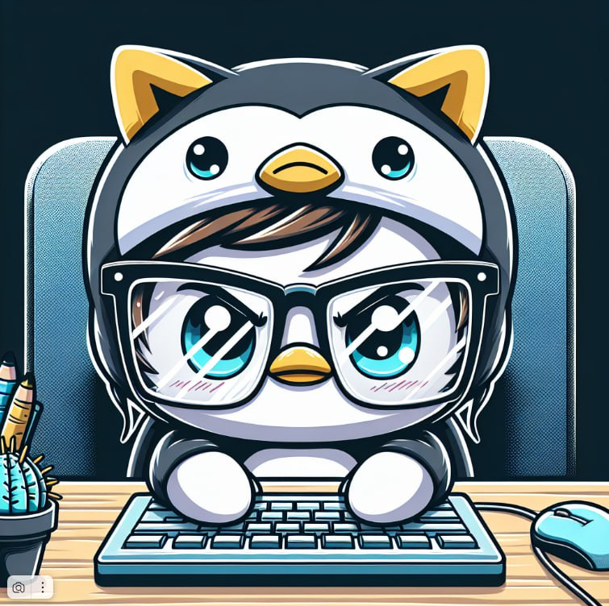
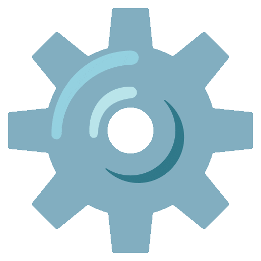
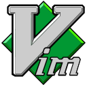
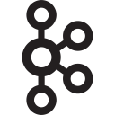
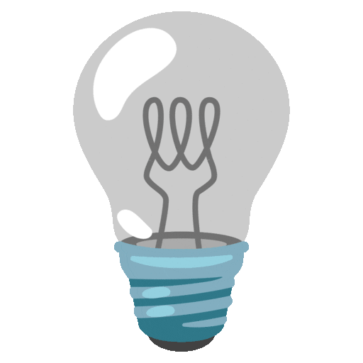

<h1 align="center">Hi, 
 I'm Nikita</h1>

<h2 align="center">
  
  Backend Developer
  

</h2>

<h2> About Me </h2>

- 💻 More than three years of experience working with Python, developing web applications using Facetapi, Aaahttp and Django.
- 🛠️ I actively use code quality control tools (Ruff, mypy, poetry, py test) to maintain high development standards.
- 📈 Continuous development, contribution to the team and improvement of skills, taking into account the innovations of the IT world.
- 📚 I prefer to work in an environment where high-quality documentation, testing and clear task statements are appreciated.
- 🚀 I aim to develop both hard and soft skills, share my experience and learn from colleagues.

<h2> Skills</h2>

### OS

  

    
    
  

### Languages

  
  
  

### Libraries/Frameworks

  
  
  
  
  
  

### Tools

  
  
  
  
  
  
  
  
  

### AMQP

  
  

### SQL / NoSQL

  
  

<h2>

Projects
</h2>

<h3><a href="https://github.com/neyakki/file_organizer">File Organizer</a></h3>

- CLI is a utility for organizing files in a specified directory;
- The utility allowed you to clean up the directories and save time for future "cleaning";
- Building an executable file was one of the fascinating processes.

<h3><a href="https://github.com/neyakki/Packs">Packs</a></h3>

- Extensions collected in specific packages, for easy disconnection between projects;
- The current project allowed us to learn about "vsix" packages and how extension packages are created;
- The next stage is its own extension for vs code.

<h2>

Stats
</h2>

